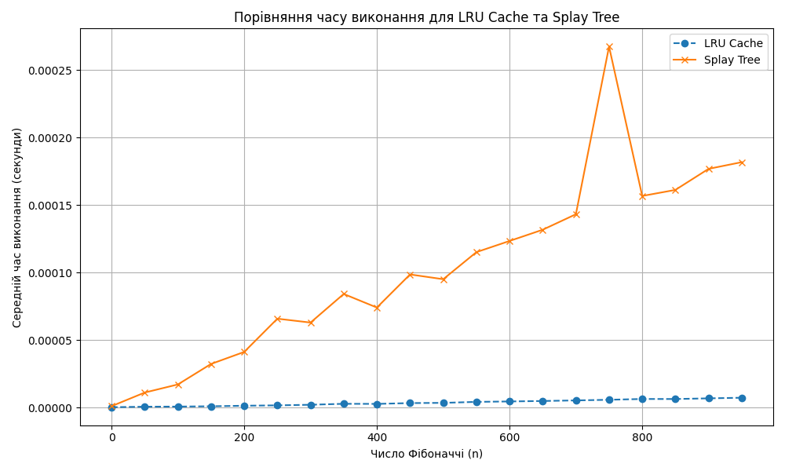

# Порівняння продуктивності: LRU Cache vs Splay Tree

## Таблиця результатів

| n | LRU Cache Time (s) | Splay Tree Time (s) |
|---|---------------------|----------------------|
| 0 | 0.00000032 | 0.00000110 |
| 50 | 0.00000070 | 0.00001117 |
| 100 | 0.00000078 | 0.00001718 |
| 150 | 0.00000102 | 0.00003237 |
| 200 | 0.00000142 | 0.00004128 |
| 250 | 0.00000170 | 0.00006588 |
| 300 | 0.00000214 | 0.00006302 |
| 350 | 0.00000285 | 0.00008419 |
| 400 | 0.00000278 | 0.00007414 |
| 450 | 0.00000338 | 0.00009866 |
| 500 | 0.00000354 | 0.00009513 |
| 550 | 0.00000428 | 0.00011518 |
| 600 | 0.00000459 | 0.00012345 |
| 650 | 0.00000493 | 0.00013178 |
| 700 | 0.00000536 | 0.00014324 |
| 750 | 0.00000583 | 0.00026744 |
| 800 | 0.00000642 | 0.00015678 |
| 850 | 0.00000639 | 0.00016127 |
| 900 | 0.00000688 | 0.00017686 |
| 950 | 0.00000735 | 0.00018182 |

## Графік виконання

## Висновки

- **LRU Cache** показує значно кращу продуктивність при великих значеннях `n`.
- **Splay Tree** демонструє повільнішу роботу.

#### Чому Splay Tree працює повільніше в цій задачі?
Splay Tree розроблене для ефективної роботи в умовах, коли певні значення часто повторно запитуються. У таких випадках дерево "вчиться" — піднімає ці значення ближче до кореня, і доступ до них стає швидшим.
Проте в нашій задачі обчислення чисел Фібоначчі йде послідовно: кожне нове значення використовує лише два попередні (`F(n-1)` і `F(n-2)`). Після цього попередні значення більше не використовуються. Відповідно, **повторних доступів немає**, і переваги Splay Tree не реалізуються.
У такому випадку перебудова дерева лише уповільнює виконання, не даючи виграшу в швидкості. Натомість **LRU Cache**, особливо у поєднанні з ітеративною реалізацією, **зберігає попередні обчислення без зайвих структурних змін**, що забезпечує стабільно швидке виконання.
